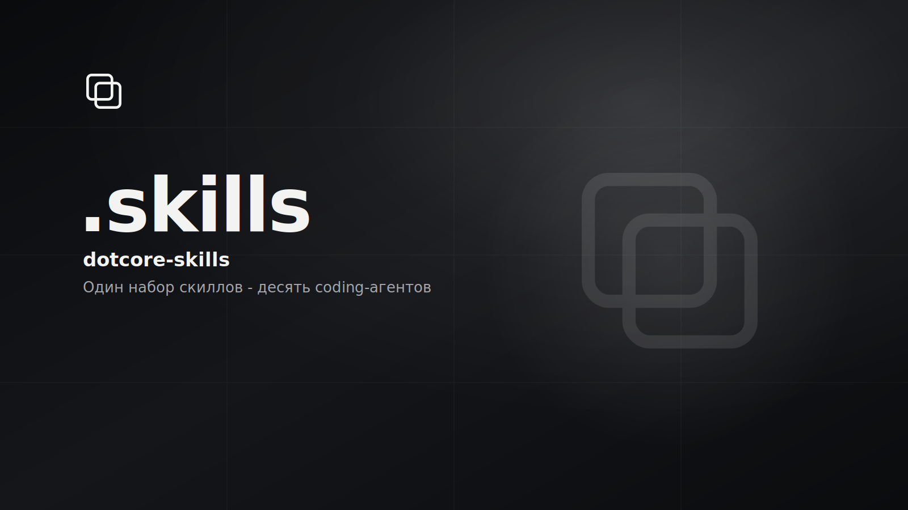

# dotcore-skills

<p>
  
  
  
  <!-- loc:start --><!-- loc:end -->
</p>



Монорепо Agent Skills для экосистемы **DotCore**: каждый скилл - папка `<name>/SKILL.md` по [спецификации](https://agentskills.io/specification), а скрипты раскладывают её в каталоги 10+ coding-агентов одним проходом. Единый конфиг путей `scripts/agents.targets.json` - источник правды и для PowerShell-установщика, и для bash-варианта (через Python 3). Скиллы ставятся user-level (глобально для агента) или копируются в конкретный репозиторий self-contained.

## Скиллы

| Скилл | Назначение | Триггеры |
|-------|------------|----------|
| [generate-readme](skills/generate-readme/) | README DotCore + `AGENTS.md`, Cursor rule, `CLAUDE.md` из фактов репозитория | «обнови README», «настрой правила проекта» |
| [_template](skills/_template/) | Заготовка нового скилла (не устанавливается) | - |

Как добавить скилл: [docs/ADDING_SKILL.md](docs/ADDING_SKILL.md).

## Установка

Из корня локального клона. Windows:

```powershell
.\scripts\install.ps1
```

macOS / Linux (нужен Python 3):

```bash
chmod +x scripts/install.sh
./scripts/install.sh
```

Выборочно - один скилл, отдельные агенты, junction вместо копии:

```powershell
.\scripts\install.ps1 -Skill generate-readme
.\scripts\install.ps1 -Agent cursor,claude,agents
.\scripts\install.ps1 -Link
```

```bash
AGENTS=cursor,claude,agents ./scripts/install.sh
LINK=1 ./scripts/install.sh
```

### Куда ставится (user-level)

Полная таблица: [docs/AGENTS_PATHS.md](docs/AGENTS_PATHS.md). Кратко:

| ID | Агент | Каталог |
|----|-------|---------|
| `cursor` | Cursor | `~/.cursor/skills/<name>/` |
| `claude` | Claude Code | `~/.claude/skills/<name>/` |
| `codex` | OpenAI Codex | `~/.codex/skills/<name>/` + `~/.codex/prompts/<name>.md` |
| `gemini` | Gemini CLI | `~/.gemini/skills/<name>/` |
| `agents` | Universal | `~/.agents/skills/<name>/` (OpenCode, Amp, Kimi, Replit) |
| `opencode` / `goose` | OpenCode, Goose | `~/.config/<agent>/skills/<name>/` |
| `roo` / `junie` | Roo Code, Junie | `~/.roo`, `~/.junie` `/skills/<name>/` |
| `amp` | Amp | `~/.config/agents/skills/<name>/` |

### В проект

Скопировать нужные папки в каталоги агентов целевого репозитория (self-contained для клонов):

```powershell
.\scripts\sync-to-project.ps1 -Target C:\path\to\repo
.\scripts\sync-to-project.ps1 -Target . -AllAgents -Link
.\scripts\sync-to-project.ps1 -Target . -Agent cursor,agents -Skill generate-readme
```

```bash
./scripts/sync-to-project.sh /path/to/repo generate-readme
ALL_AGENTS=1 LINK=1 ./scripts/sync-to-project.sh .
```

По умолчанию `sync-to-project` ставит только в `.cursor/skills/`. Флаг `-AllAgents` / `ALL_AGENTS=1` - во все project-level каталоги из [agents.targets.json](scripts/agents.targets.json).

## Команды

| Команда | Назначение |
|---------|------------|
| `.\scripts\install.ps1` | Установить все скиллы во всех агентов (user-level) |
| `.\scripts\install.ps1 -Agent cursor,claude` | Только выбранные агенты по ID |
| `.\scripts\install.ps1 -Skill generate-readme` | Один скилл |
| `.\scripts\install.ps1 -Link` | Junction/symlink вместо копии (разработка) |
| `.\scripts\install.ps1 -ListAgents` | Список ID агентов и путей |
| `.\scripts\sync-to-project.ps1 -Target <path> -AllAgents` | Скиллы в project-level каталоги репозитория |

Bash-эквиваленты: `./scripts/install.sh`, фильтры через переменные окружения (`AGENTS=`, `LINK=1`, `ALL_AGENTS=1`), список - `--list-agents`. Имя скилла - первым позиционным аргументом.

## Стек

<p>
  
  
  
  
  
  
</p>

## CI

`.github/workflows/validate-skills.yml` запускается на изменения в `skills/**` и проверяет каждый скилл (кроме `_*`): наличие `SKILL.md`, YAML-frontmatter, поля `name`/`description`, совпадение имени папки с `name`.

## Архитектура

Монорепо без сборки и пакетного менеджера: контент - markdown-скиллы, логика - два параллельных установщика (PowerShell и bash+Python) поверх общего JSON-конфига путей. Каждый скилл self-contained, поэтому одну папку можно скопировать в любой агент или репозиторий без зависимостей.

```text
dotcore-skills/
├── skills/
│   ├── generate-readme/      # SKILL.md + references (.md), codex-prompt.md
│   └── _template/            # заготовка, в установку не попадает
├── scripts/
│   ├── agents.targets.json   # user/project пути всех агентов - источник правды
│   ├── install.ps1           # user-level установка (Windows)
│   ├── install.sh            # то же на Unix, читает JSON через Python 3
│   ├── sync-to-project.ps1   # копия скиллов в .<agent>/skills/ репозитория
│   └── sync-to-project.sh
├── docs/
│   ├── ADDING_SKILL.md
│   └── AGENTS_PATHS.md
├── .github/workflows/
│   └── validate-skills.yml   # CI: frontmatter и имя папки == name
├── AGENTS.md
└── README.md
```

- **Один конфиг путей**: `agents.targets.json` читают и PowerShell, и Python - расхождений между установщиками нет.
- **Скилл self-contained**: папка `skills/<name>/` копируется целиком; клон работает без monorepo.
- **`_`-папки не ставятся**: фильтр в обоих установщиках и пропуск в CI.
- **Имя папки == `name`** во frontmatter `SKILL.md` - инвариант, который проверяет CI.
- **README и `AGENTS.md` генерируются** скиллом `generate-readme`, не правятся вручную.

## Лицензия

© 2026 DotCore. Все права защищены. Использование, копирование, изменение и распространение запрещены без письменного разрешения автора. Исходный код открыт только для ознакомления. См. [LICENSE](LICENSE).
