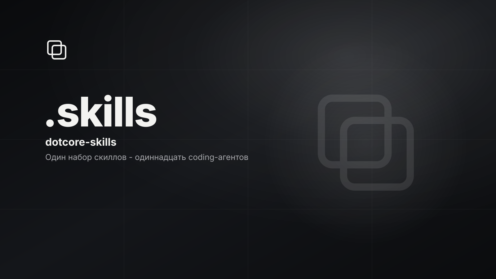

# dotcore-skills

<p>
  
  
  
  <!-- loc:start --><!-- loc:end -->
</p>



<!-- audit:start -->
<p>
  <a href="docs/audit/latest.md"></a>
  <a href="docs/audit/2026-10-03-quiet-harbor.md"></a>
</p>
<!-- audit:end -->

Монорепо Agent Skills для экосистемы **DotCore**: каждый скилл - папка `<name>/SKILL.md` по [спецификации](https://agentskills.io/specification). Скрипты одним проходом раскладывают её в каталоги coding-агентов, включая Grok. Пути задаёт `scripts/agents.targets.json`: его читают PowerShell-установщик и bash-вариант через Python 3.

## Скиллы

Ставятся 11 скиллов. Папку `_template` установщики и CI пропускают.

| Скилл | Назначение | Триггеры |
|-------|------------|----------|
| [generate-readme](skills/generate-readme/) | README в стандарте DotCore и правила агентов. Проза через `text-naturalizer` и `sepia`, обложка SVG | «обнови README», «настрой правила проекта» |
| [sync-project-rules](skills/sync-project-rules/) | Только `AGENTS.md` и rule-файлы, без README, обложки и LoC | «обнови AGENTS.md», «синхронизируй правила проекта» |
| [pre-deploy-audit](skills/pre-deploy-audit/) | Утечки и код перед деплоем или public. Полный режим пишет findings и coverage ledger | «аудит безопасности», «найди уязвимости», «проверь на утечки» |
| [generate-dotcore-image](skills/generate-dotcore-image/) | Картинки в стиле DotCore: генерация или restyle. Raster, если модель умеет, иначе SVG | «картинка в стиле dotcore», «перерисуй в .ядро» |
| [generate-styled-image](skills/generate-styled-image/) | Кадр в стиле из файла канона этого запроса. Сюжет только из текущего фрагмента | «в этом стиле», «по канону», «иллюстрация к фрагменту» |
| [dotcore-design](skills/dotcore-design/) | UX/UI для web, mobile и desktop: сценарии, дизайн-система, ревью | «спроектируй интерфейс», «проверь UX/UI» |
| [sepia](skills/sepia/) | De-AI: художественный текст и профессиональная проза, русский регистр DotCore | «убери ИИ-слог», «humanize» |
| [author-voice](skills/author-voice/) | Профиль своего голоса: создать, обновить, применить | «сохрани мой стиль», «пиши как я» |
| [text-naturalizer](skills/text-naturalizer/) | Редактура сообщений и прозы без обещаний обхода детекторов | «сделай текст живым», «убери шаблонность» |
| [launch-video](skills/launch-video/) | Короткий ролик по реальным функциям проекта: раскадровка, видео, подпись | «сделай launch video», «product demo» |
| [html-motion](skills/html-motion/) | Автономные HTML-сцены. По умолчанию режим DotCore | «сгенерируй HTML-анимацию», «animated hero» |
| [_template](skills/_template/) | Заготовка нового скилла (не устанавливается) | - |

Как добавить скилл: [docs/ADDING_SKILL.md](docs/ADDING_SKILL.md).

## Установка

Из корня клона. Windows, PowerShell 5.1+:

```powershell
.\scripts\install.ps1
```

macOS / Linux, нужен Python 3:

```bash
chmod +x scripts/install.sh
./scripts/install.sh
```

Несколько скиллов через запятую, отдельные агенты, ссылка вместо копии:

```powershell
.\scripts\install.ps1 -Skill generate-readme,sepia
.\scripts\install.ps1 -Agent cursor,claude,agents
.\scripts\install.ps1 -Link
```

```bash
./scripts/install.sh generate-readme,sepia
AGENTS=cursor,claude,agents ./scripts/install.sh
LINK=1 ./scripts/install.sh
```

`-Link` на Windows ставит junction. `LINK=1` на Unix ставит symlink.

### Куда ставится (user-level)

Полная таблица: [docs/AGENTS_PATHS.md](docs/AGENTS_PATHS.md).

| ID | Агент | Каталог |
|----|-------|---------|
| `cursor` | Cursor | `~/.cursor/skills/<name>/` |
| `claude` | Claude Code | `~/.claude/skills/<name>/` |
| `codex` | OpenAI Codex | `~/.codex/skills/<name>/` + `~/.codex/prompts/<name>.md` |
| `gemini` | Gemini CLI | `~/.gemini/skills/<name>/` |
| `agents` | Universal | `~/.agents/skills/<name>/` |
| `opencode` | OpenCode | `~/.config/opencode/skills/<name>/` |
| `goose` | Goose | `~/.config/goose/skills/<name>/` |
| `roo` | Roo Code | `~/.roo/skills/<name>/` |
| `junie` | Junie | `~/.junie/skills/<name>/` |
| `amp` | Amp | `~/.config/agents/skills/<name>/` |
| `grok` | Grok | `~/.grok/skills/<name>/` |

`amp` есть только в user-level. В project-level его каталога нет.

### В проект

```powershell
.\scripts\sync-to-project.ps1 -Target C:\path\to\repo
.\scripts\sync-to-project.ps1 -Target . -AllAgents -Link
.\scripts\sync-to-project.ps1 -Target . -Agent cursor,agents -Skill generate-readme,sepia
```

```bash
./scripts/sync-to-project.sh /path/to/repo generate-readme,sepia
ALL_AGENTS=1 LINK=1 ./scripts/sync-to-project.sh .
```

Без `-AllAgents` и без `ALL_AGENTS=1` скрипт пишет только в `.cursor/skills/`.

## Команды

| Команда | Назначение |
|---------|------------|
| `.\scripts\install.ps1` | Все скиллы во все user-level каталоги |
| `.\scripts\install.ps1 -Agent cursor,claude` | Только выбранные агенты |
| `.\scripts\install.ps1 -Skill generate-readme,sepia` | Один или несколько скиллов через запятую |
| `.\scripts\install.ps1 -Link` | Junction вместо копии |
| `.\scripts\install.ps1 -ListAgents` | ID агентов и пути |
| `.\scripts\sync-to-project.ps1 -Target <path> -Skill generate-readme,sepia` | Выбранные скиллы в репозиторий |
| `.\scripts\sync-to-project.ps1 -Target <path> -AllAgents` | Все project-level каталоги из конфига |

Bash: `./scripts/install.sh`, скиллы первым аргументом через запятую (`./scripts/install.sh generate-readme,sepia`), фильтры `AGENTS=` и `LINK=1`, список `--list-agents`. У `sync-to-project.sh` цель - первый аргумент, скиллы - второй: `./scripts/sync-to-project.sh . generate-readme,sepia`. Все агенты: `ALL_AGENTS=1`.

## Стек

<p>
  
  
  
  
  
</p>

## CI

`.github/workflows/validate-skills.yml` на `push` и `pull_request` проверяет каждый скилл, кроме `_*`: есть `SKILL.md`, frontmatter, поля `name` и `description`, имя папки совпадает с `name`. Если в README есть блок аудита, CI проверяет, что его `href` ведут на существующие файлы. Для `pre-deploy-audit` гоняет `node --check` и два теста:

```bash
node skills/pre-deploy-audit/validate-findings.test.cjs
node skills/pre-deploy-audit/validate-coverage-ledger.test.cjs
```

## Архитектура

Сборки и пакетного менеджера нет. Контент - markdown-скиллы, логика - два установщика поверх одного JSON-конфига.

```text
dotcore-skills/
├── skills/
│   ├── generate-readme/         # README + правила (делегирует sync-project-rules)
│   ├── sync-project-rules/      # только AGENTS.md + rule-файлы агентов
│   ├── pre-deploy-audit/        # утечки + coverage-led code security
│   ├── generate-dotcore-image/  # PNG/SVG в стиле DotCore
│   ├── generate-styled-image/   # кадр в стиле из файла канона
│   ├── dotcore-design/          # UX/UI для web, mobile и desktop
│   ├── sepia/                   # de-AI: fiction и проф. проза
│   ├── text-naturalizer/        # редактура сообщений и прозы
│   ├── author-voice/            # профиль своего голоса
│   ├── launch-video/            # короткий ролик по функциям проекта
│   ├── html-motion/             # автономные HTML-сцены
│   └── _template/               # заготовка, в установку не попадает
├── scripts/
│   ├── agents.targets.json      # user/project пути - источник правды
│   ├── install.ps1              # user-level, Windows
│   ├── install.sh               # то же на Unix, JSON через Python 3
│   ├── sync-to-project.ps1
│   └── sync-to-project.sh
├── docs/
│   ├── cover.svg                # обложка README
│   ├── cover.png
│   ├── audit/                   # снимки pre-deploy-audit + latest.md
│   ├── ADDING_SKILL.md
│   └── AGENTS_PATHS.md
├── .github/workflows/
│   └── validate-skills.yml
├── AGENTS.md
└── README.md
```

- **Один конфиг путей**: `agents.targets.json` читают PowerShell и Python.
- **Скилл self-contained**: папка `skills/<name>/` копируется целиком.
- **`_`-папки не ставятся**: фильтр в обоих установщиках и пропуск в CI.
- **Имя папки == `name`** во frontmatter `SKILL.md`. Это проверяет CI.
- **Полный security-аудит**: промежуточные run-артефакты не пишутся в target без явного ignored-каталога.
- **Блок `<!-- audit:start/end -->`** переносится дословно. Каталог `docs/audit/` этот скилл не правит.

## Лицензия

© 2026 DotCore. Все права защищены.

Проприетарный код. Использование, копирование, изменение и распространение запрещены без письменного разрешения автора. Исходный код открыт только для ознакомления. См. [LICENSE](LICENSE).
